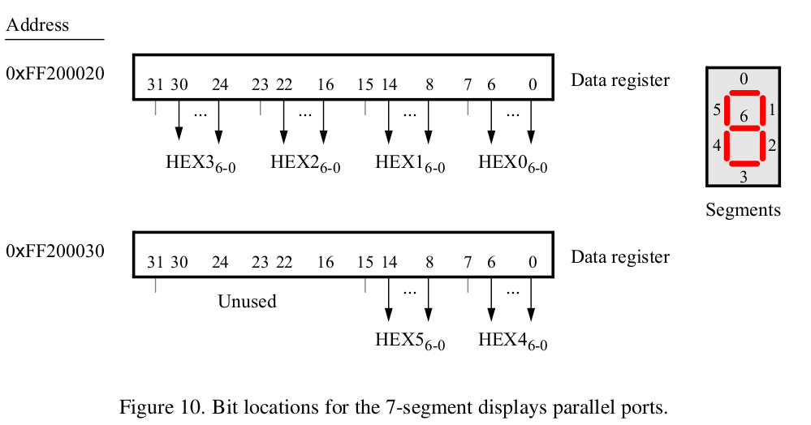
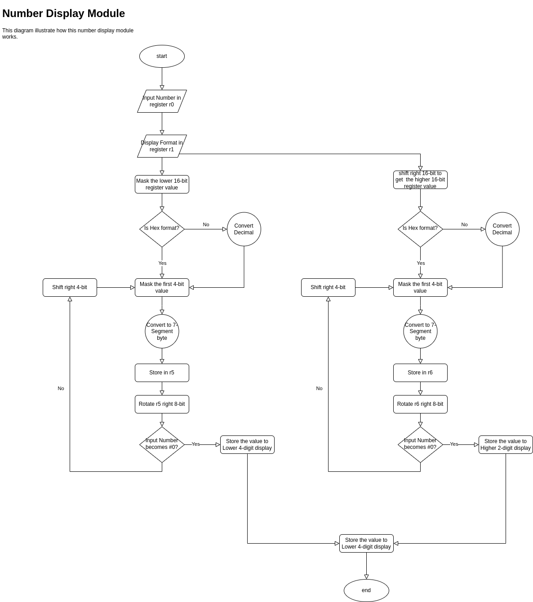
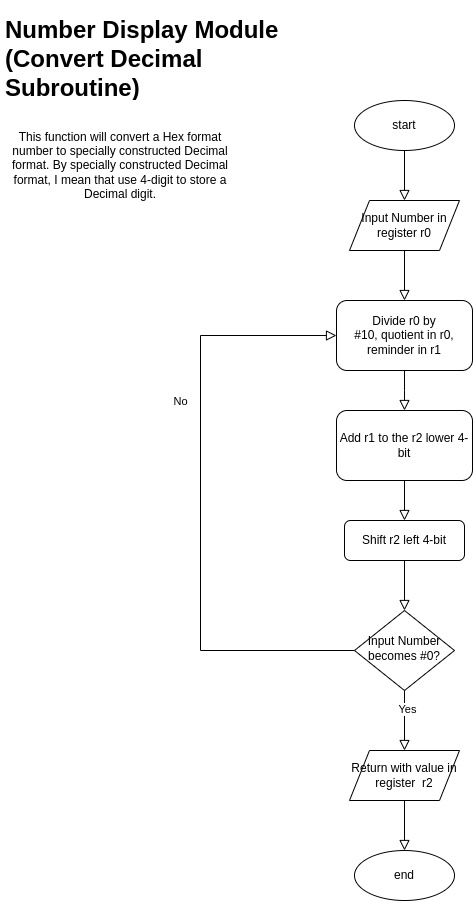
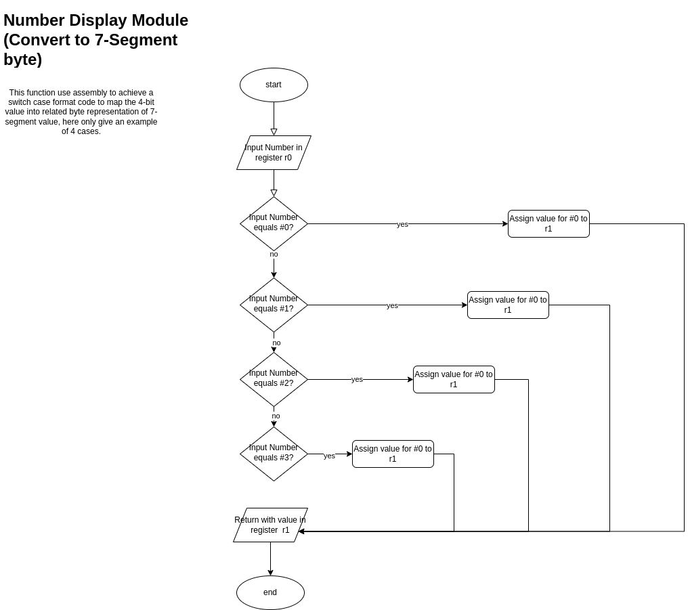
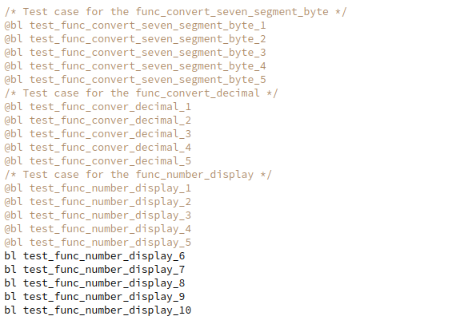

# Lab1 Fibonacci Array

# Objective

This lab is about programming an ARM®Cortex-A9 on a DE1 SoC board in the ARMv7 assembly language. For
this lab, you can use an online simulator to test your code.
• The simulator is available at https://cpulator.01xz.net/?sys=arm-de1soc.
◦ This simulator runs in your browser and should work with any computer system.
◦ This simulator is not recommended for tablets, but might still work.
◦ This simulator is reported to run best in Firefox. If the emulator doesn’t seem to work well in your
browser of choice (Safari, Edge, Chrome, etc.), try Firefox first before complaining to me.
• Alternatively, if you have (or are willing to purchase) an actual ARM®Cortex-A9 and a suitable develop-
ment board, then by all means do so! Please take some pictures to include with your report.
The goal of this lab is to implement the following system:
Write the first 10 Fibonacci numbers to a seven segment display. Show each number on the dis-
play for one second (1 s) before showing the next. Your program should endlessly loop, cycling
through displaying these 10 numbers.
The Fibonacci numbers are defined as F n :
F 0 = 0, F 1 = 1, and F n = F n−1 + F n−2 for n > 1.

# Solution

Support **Hex** and **Decimal** format display. Display module easy to reuse for other project.


# Implementation

## Number Display Module

As shown in the System Overview block diagram above, the number display module accept a Hex Fibonacci Number and a format as inputs, and drive the seven-segment displays to show the results.

According to the DE-1 SoC Data Sheet [1], there are two parallel ports connected to the 7-segment displays on the DE1-SoC board, each of which comprises a **32-bit** write-only Data register as shown below. Data can be written into these
two registers, and read back, by using **word operations**.



We can use **`EQU`** [2] to represent a byte sequence of the map relationship between **one** digit and the 7-segment **byte** value, then we use **bit mask** and **add** operations to manipulate all 6 digits divided by two 32-bit registers.

 ```asm
     /* map of digit to 7-segment byte representation */
     .equ d_0, 0b00111111
     .equ d_1, 0b00000110
     .equ d_2, 0b01011011
     .equ d_3, 0b01001111
     .equ d_4, 0b01100110
     .equ d_5, 0b01101101
     .equ d_6, 0b01111101
     .equ d_7, 0b00000111
     .equ d_8, 0b01111111
     .equ d_9, 0b01100111
     .equ d_a, 0b01110111
     .equ d_b, 0b01111100
     .equ d_c, 0b00111001
     .equ d_d, 0b01011110
     .equ d_e, 0b01111011
     .equ d_f, 0b01110001
 
     .equ digit_byte_mask, 0b11111111
     .equ clear_all, 0x0
     
     /* Address macro for 7-segment display registers word write only */
     .equ L_display, 0xff200020 @Lower 4 digits address
     .equ H_display, 0xff200030 @ Higher 2 digits address only 16-bit used
 ```

This module would support two display modes, one in **hex** format, the other in **decimal** format. And due to the fact that we only have 6 digit available, so the input value range for hex format is `0x00000 ~ 0xffffff` and Decimal if `0 ~ 999999`, this logic will be controlled by the **control module**!

**Note:**

In fact, even if we only have 6 seven-segment displays available, we can still display larger number by **scrolling digits**! But it is way beyond the content of this assignment, so I decide to do it the simple way.


**Main Logic**

This function will divide the input number into two halves, and then process them separately.

In each process, the input value would be processed every 4-bit and store then rotate them to 4 designated 4 bytes. 



### Convert Decimal Subroutine

In order to support the Decimal format of display, we need to do some conversion to the input value, to convert the input value into a specially constructed Decimal format, which is use 4-bit to store the value of a Decimal bit.




But, **sadly** the processor we are using right now doesn't support division operation in hardware design, but luckily we can use other way to achieve this [3]. Which means we use multiply to achieve division operation.  https://www.youtube.com/watch?v=ssDBqQ5f5_0

### Convert 7-Segment Byte Subroutine

We need to use Assembly to do a switch case to map the binary representation of every digit to it's 7-segment byte, flow chart as followed




# Test

## Number Display Module

Follow the test theory of software engineering, I try to test the assembly function I wrote with the shortest test case.

```bash
# Case 1
Hex format, 0x3210
Hex format, 0x7654
Hex format, 0xba98
Hex format, 0xfedc

# Case 2
Hex format, 0x000000
Hex format, 0x543210
Hex format, 0xffffff

# Case 3
Dec format, 0x04d2=1234
Dec format, 0x162E=5678

# Case 4
Dec format, 0x0=000000
Dec format, 0x1e240=123456
Dec format, 0x423f=999999
```



# Analysis

# Reference

[1] http://www-ug.eecg.toronto.edu/desl/arm_SoC.html

[2] https://developer.arm.com/documentation/dui0473/m/directives-reference/equ

[3] https://www.youtube.com/watch?v=ssDBqQ5f5_0

[4] https://godbolt.org/
