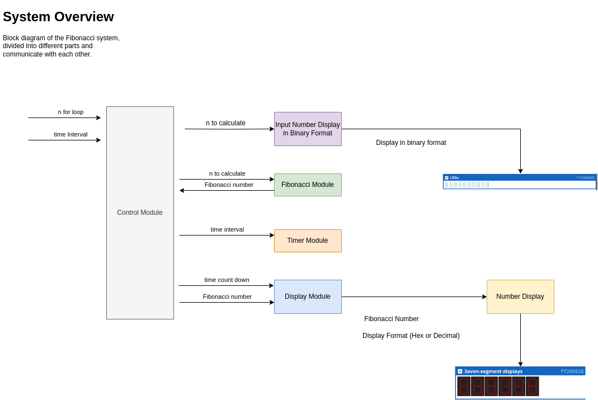
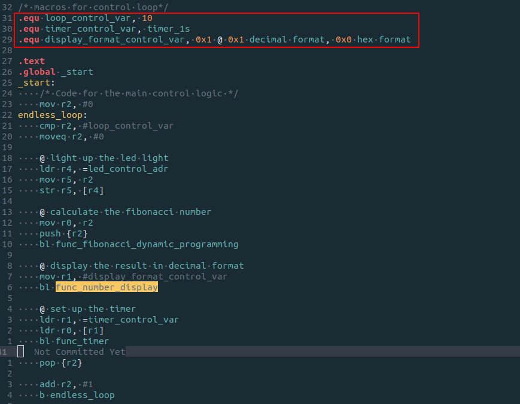
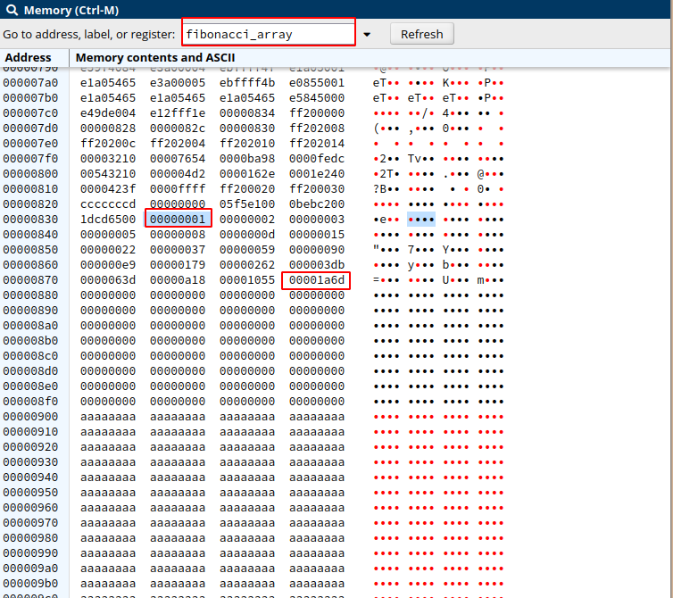
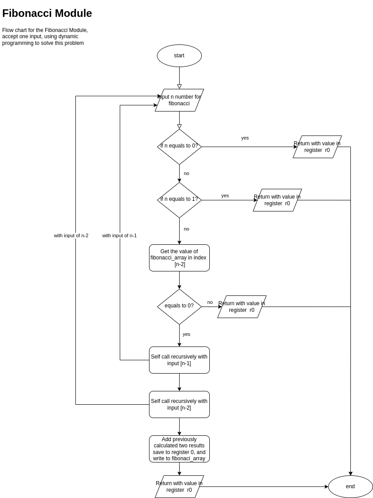
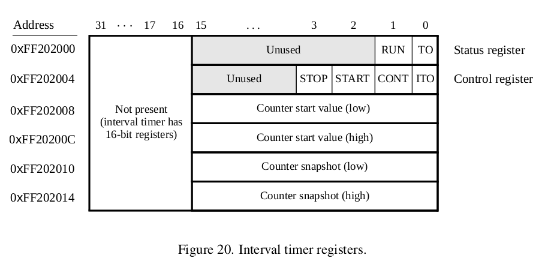
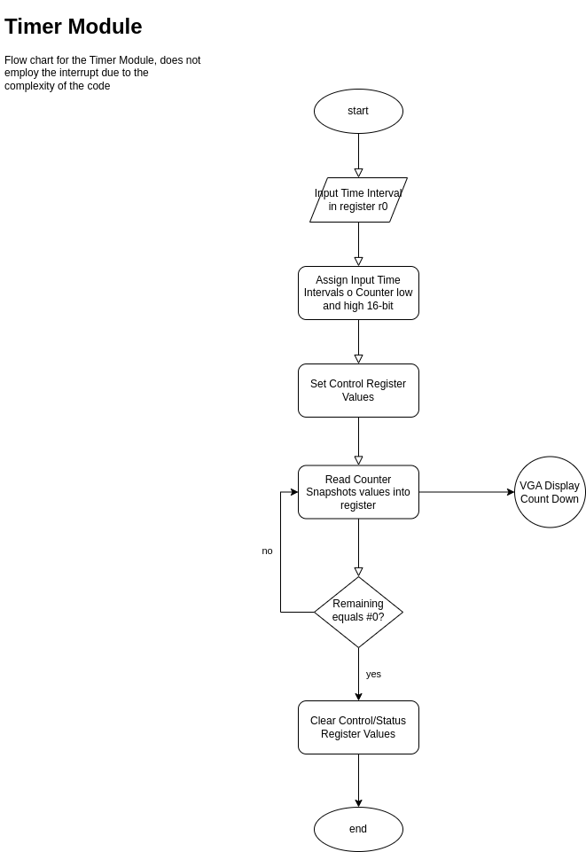
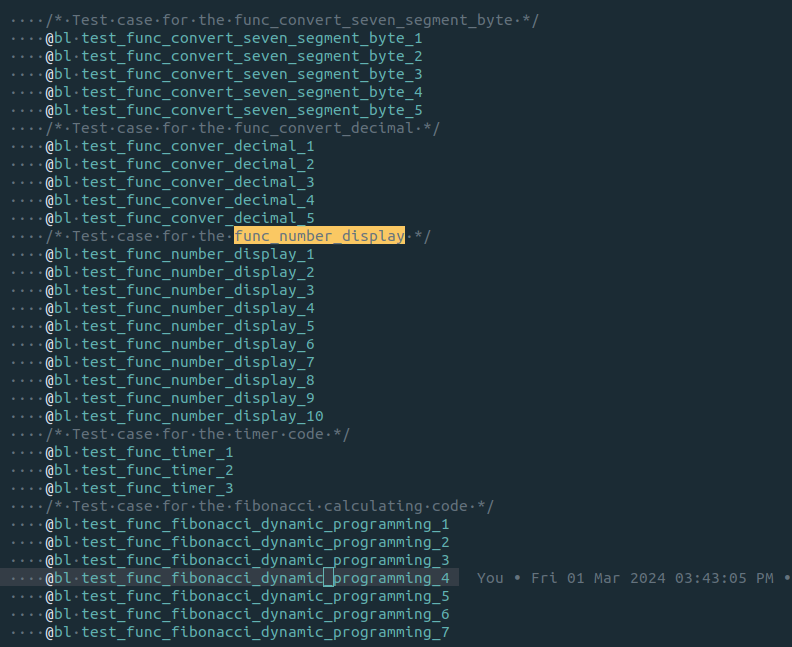
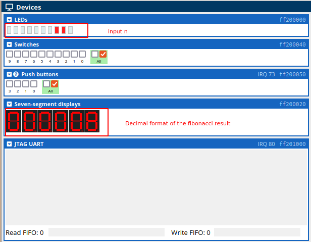

# Lab1 Fibonacci Array

# Objective

This lab is about programming an ARM®Cortex-A9 on a DE1 SoC board in the ARMv7 assembly language. For
this lab, you can use an online simulator to test your code.
• The simulator is available at https://cpulator.01xz.net/?sys=arm-de1soc.
	◦ This simulator runs in your browser and should work with any computer system.
	◦ This simulator is not recommended for tablets, but might still work.
	◦ This simulator is reported to run best in Firefox. If the emulator doesn’t seem to work well in your browser of choice (Safari, Edge, Chrome, etc.), try Firefox first before complaining to me.
• Alternatively, if you have (or are willing to purchase) an actual ARM®Cortex-A9 and a suitable develop-
ment board, then by all means do so! Please take some pictures to include with your report.
The goal of this lab is to implement the following system:
Write the first 10 Fibonacci numbers to a seven segment display. Show each number on the dis-
play for one second (1 s) before showing the next. Your program should endlessly loop, cycling
through displaying these 10 numbers.
The Fibonacci numbers are defined as F n :
F 0 = 0, F 1 = 1, and F n = F n−1 + F n−2 for n > 1.

# Solution

Support **Hex** and **Decimal** format display. Display Module, Timer Module as well as Fibonacci Module easy to reuse for other project.

And I implement and test in the following order, this can be checked at this program `github link`: https://github.com/dcheng69/Sensor_Network_and_Embedded_Systems/tree/dev-lab1

1. Number Display Module
2. Timer Module
3. Fibonacci Module
4. Control Logic Module



# Implementation

## Control Logic

https://github.com/dcheng69/Sensor_Network_and_Embedded_Systems/commit/8393c5c4b817d25a2c979ef86b1eaf7a954671ab

The main control logic is screen-shot as below:

* the loop can be controlled by macro `loop_control_var`
* the time duration can be changed by the `timer_control_var`
* the display format of whether `hex` or `decimal` can be controlled by `display_format_control_var`



## Fibonacci Module

https://github.com/dcheng69/Sensor_Network_and_Embedded_Systems/commit/75cc69fbe06fb69d6c54c58deb11e45f37233c9f

Use Dynamic Programming [5] technique, we would be able to calculate the Fibonacci values for a given input quick and optimised speed. In order to do this we would need to set up a space of memory used as an array! like below.



The flow chart of the Programming is listed below:



## Timer module

https://github.com/dcheng69/Sensor_Network_and_Embedded_Systems/commit/056204c3f6ea666d3983e7ed07ff36d3e143ff31

According to the DE-1 SoC Data Sheet [1], the timer can be loaded with a preset value, and then counts down to zero using a 100-MHz clock. The programming interface for the timer includes six 16-bit registers, as illustrated below:



* TO provides a timeout signal which is set to 1 by the timer when it has reached a count value of zero. The TO
  bit can be reset by writing a 0 into it.
* RUN is set to 1 by the timer whenever it is currently counting. Write operations to the status halfword do not
  affect the value of the RUN bit.
* ITO is used for generating interrupts.
* CONT affects the continuous operation of the timer. When the timer reaches a count value of zero it auto-
  matically reloads the specified starting count value. If CONT is set to 1, then the timer will continue counting
  down automatically. But if CONT = 0 , then the timer will stop after it has reached a count value of 0.
* (START/STOP) is used to commence/suspend the operation of the timer by writing a 1 into the respective bit.

The two 16-bit registers at addresses `0xFF202008` and `0xFF20200C` allow the period of the timer to be changed
by setting the starting count value. The default setting provided in the DE1-SoC Computer gives a timer period
of 125 msec. To achieve this period, the starting value of the count is 100 MHz × 125 msec = 12.5 × 10 6 . It is
possible to capture a snapshot of the counter value at any time by performing a write to address `0xFF202010`. This
write operation causes the current 32-bit counter value to be stored into the two 16-bit timer registers at addresses
`0xFF202010` and `0xFF202014`. These registers can then be read to obtain the count value.


Ideally, we should use the **interrupt** of the timer, but that will involve the set up of **`interrupts Vector Table`**, thus we choose to do it in a simple but less accuracy way, and leave this code for future modification!

Due to the fact that the ARM processor has a relatively higher frequency than `100MHz`, so we can read the counter snapshot register to read and compare the value of the time count.




## Number Display Module

https://github.com/dcheng69/Sensor_Network_and_Embedded_Systems/commit/c423fe358e2bb88a8656d3ca9126c54d4945f1fe

As shown in the System Overview block diagram above, the number display module accept a Hex Fibonacci Number and a format as inputs, and drive the seven-segment displays to show the results.

According to the DE-1 SoC Data Sheet [1], there are two parallel ports connected to the 7-segment displays on the DE1-SoC board, each of which comprises a **32-bit** write-only Data register as shown below. Data can be written into these
two registers, and read back, by using **word operations**.


We can use **`EQU`** [2] to represent a byte sequence of the map relationship between **one** digit and the 7-segment **byte** value, then we use **bit mask** and **add** operations to manipulate all 6 digits divided by two 32-bit registers.

 ```asm
     /* map of digit to 7-segment byte representation */
     .equ d_0, 0b00111111
     .equ d_1, 0b00000110
     .equ d_2, 0b01011011
     .equ d_3, 0b01001111
     .equ d_4, 0b01100110
     .equ d_5, 0b01101101
     .equ d_6, 0b01111101
     .equ d_7, 0b00000111
     .equ d_8, 0b01111111
     .equ d_9, 0b01100111
     .equ d_a, 0b01110111
     .equ d_b, 0b01111100
     .equ d_c, 0b00111001
     .equ d_d, 0b01011110
     .equ d_e, 0b01111011
     .equ d_f, 0b01110001
 
     .equ digit_byte_mask, 0b11111111
     .equ clear_all, 0x0
     
     /* Address macro for 7-segment display registers word write only */
     .equ L_display, 0xff200020 @Lower 4 digits address
     .equ H_display, 0xff200030 @ Higher 2 digits address only 16-bit used
 ```

This module would support two display modes, one in **hex** format, the other in **decimal** format. And due to the fact that we only have 6 digit available, so the input value range for hex format is `0x00000 ~ 0xffffff` and Decimal if `0 ~ 999999`, this logic will be controlled by the **control module**!

**Note:**

In fact, even if we only have 6 seven-segment displays available, we can still display larger number by **scrolling digits**! But it is way beyond the content of this assignment, so I decide to do it the simple way.


### **Main Logic**

This function will divide the input number into two halves, and then process them separately.

In each process, the input value would be processed every 4-bit and store then rotate them to 4 designated 4 bytes. 


### Convert Decimal Subroutine

In order to support the Decimal format of display, we need to do some conversion to the input value, to convert the input value into a specially constructed Decimal format, which is use 4-bit to store the value of a Decimal bit. In this case a hex number `0x4d2` in decimal 1234 would be read as hex `0x1234`


But, **sadly** the processor we are using right now doesn't support division operation in hardware design, but luckily we can use other way to achieve this [3]. Which means we use multiply to achieve division operation.  https://www.youtube.com/watch?v=ssDBqQ5f5_0

### Convert 7-Segment Byte Subroutine

We need to use Assembly to do a switch case to map the binary representation of every digit to it's 7-segment byte, flow chart as followed


# Test

Below is the test cases for this project:



## Control Logic



## Fibonacci Module

Based on the implementation, test the Fibonacci results with the following input values

```asm
# case 1
# input = 0

# case 2
# input = 1

# case 3
# input = 2

# case 4
# input = 3

# case 5
# input = 4

# case 6
# input = 10

# case 7
# input = 20
```

We can also examine the memory of `fibonaci_array`


## Number Display Module

Based on the implementation, the timer is clearly not accuracy. But we can still use a LED to test this program.

```bash
# case 1
# 1s interval
# light led for 1s

# 2s interval
# light led for 2s

# 5s interval
# light led for 5s
```

## Number Display Module

Follow the test theory of software engineering, I try to test the assembly function I wrote with the shortest test case.

```bash
# Case 1
Hex format, 0x3210
Hex format, 0x7654
Hex format, 0xba98
Hex format, 0xfedc

# Case 2
Hex format, 0x000000
Hex format, 0x543210
Hex format, 0xffffff

# Case 3
Dec format, 0x04d2=1234
Dec format, 0x162E=5678

# Case 4
Dec format, 0x0=000000
Dec format, 0x1e240=123456
Dec format, 0x423f=999999
```

# Analysis

This program is a good implementation of high cohesion and low coupling. It employs **dynamic programming** technique to calculate the Fibonacci result, and I developed a driver that support two display formats **hex** and **decimal**, and encapsulation the **timer** as a function. And I provide three **control variables** that you can easily change to adjust the program to behave differently! (Though that don't exceed the actual input range of `0 ~ 53`, this is because the `fibonacci_array` I allocated for the dynamic programming can only store 50 numbers!)

But the program lacks **range check** for the input value for the modules, which should be modified in the later usage, and because we didn't use the interrupt mode of the timer, so the actual time range could be slightly more than the `1s` duration due to the fact of other code running, but it's acceptable for its simplicity of the current solution.

It took me **one day** on the Number display module, **one hour **on the timer module, **one hour** on the Fibonacci Module, and **half an hour** on the Control logic module, it's easy to extends, and easy to main due to the module design.

And the whole project has been upload to a public `github repo`: https://github.com/dcheng69/Sensor_Network_and_Embedded_Systems/tree/dev-lab1

Honestly speaking, I think I did a good job here, and it worth a full mark!

# Reference

[1] http://www-ug.eecg.toronto.edu/desl/arm_SoC.html

[2] https://developer.arm.com/documentation/dui0473/m/directives-reference/equ

[3] https://www.youtube.com/watch?v=ssDBqQ5f5_0

[4] https://godbolt.org/

[5] https://en.wikipedia.org/wiki/Dynamic_programming
