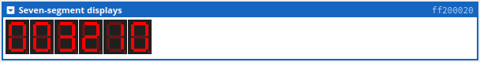
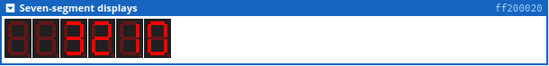
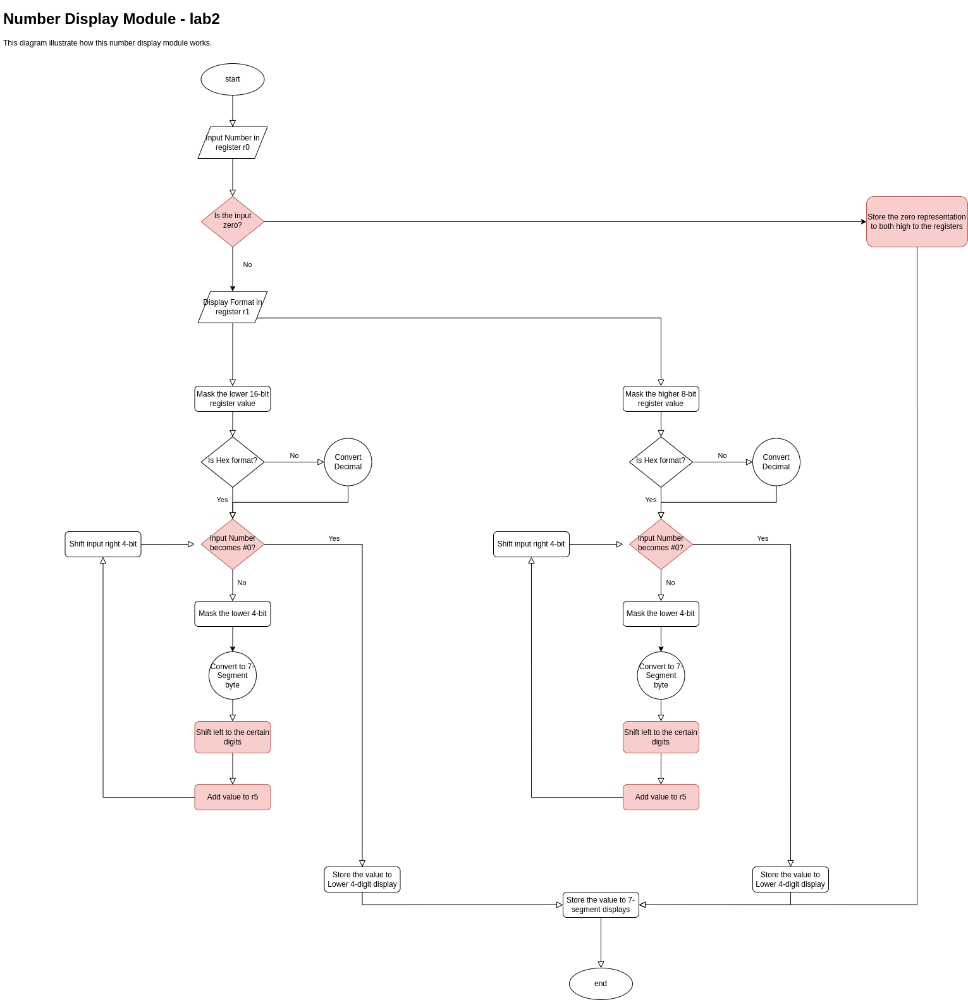
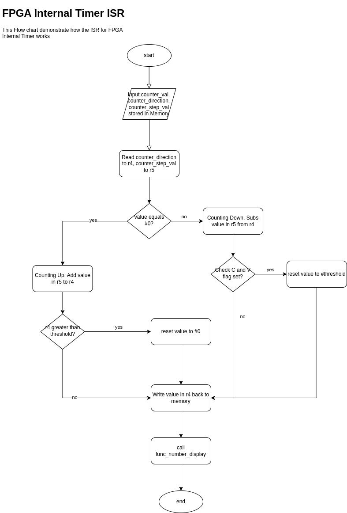
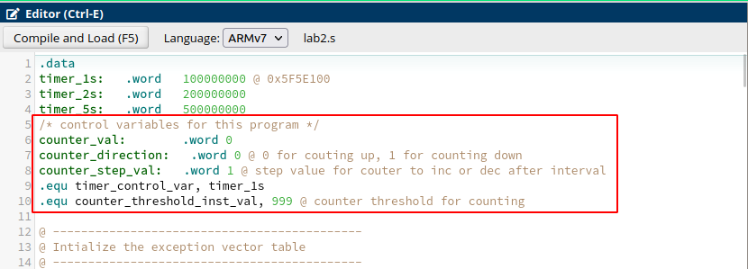
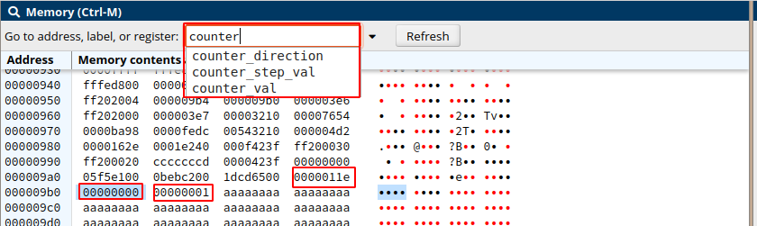
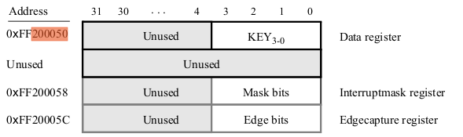
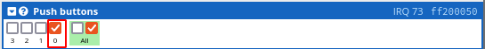

# Three-Digit counter

## Objective

This lab is about programming an ARM®Cortex-A9 on a DE1 SoC board. For this lab, you can use an online
simulator to test your code.

* The simulator is available at https://cpulator.01xz.net/?sys=arm-de1soc.
  *  This simulator runs in your browser and should work with any computer system.
  * This simulator is not recommended for tablets, but might still work.
  * This simulator is reported to run best in Firefox. If the emulator doesn’t seem to work well in your
    browser of choice (Safari, Edge, Chrome, etc.), try Firefox first before complaining to me.
* Alternatively, if you have (or are willing to purchase) an actual ARM®Cortex-A9 and a suitable develop-
  ment board, then by all means do so! Please take some pictures to include with your report.

The goal of this lab is to implement the following system:

**Create a three-digit decimal counter that accurately counts 1 s intervals. The count should be displayed as a decimal number on the 7-segment display. An interrupt-enabled push button should be used to reverse the direction of the counter. The count should roll over to zero after reaching 999 (if counting up), or vice versa if counting down.**

Your program should run in a **continuous loop**.
You **must** use interrupts to handle the push button input. You may continue to use interrupts with the timer to
handle the 1 s counter, or poll the timer for the 1 s interval. You must use the timer to count for 1 s.

## System Design

For the previous `lab1`, I have already created a 7-segment display driver to display numbers either in hex or decimal format. So I can reuse that `number display` module, and make some modifications to it. After that I will develop a new timer module with interrupt enabled. Then I will add `ISR` for the switch which controls the counting direction of the counter. Finally, I will write a control module which runs a infinite loop and controls the logic of the behaviour of the counter.

### Steps

1. Port and modify the 7-segment display driver developed in `lab1`
2. Develop a new timer module runs on interrupt
3. Implement an `ISR` for the switch which will set the control bit in memory indicating the counting direction.
4. Finally, implement the control logic and doing the testing.

## Number Display Module

### Porting from `Lab1`

https://github.com/dcheng69/Sensor_Network_and_Embedded_Systems/commit/c423fe358e2bb88a8656d3ca9126c54d4945f1fe

From the above `github` link I import the `func_number_display` along with it's test cases `test_func_number_display_1` to ``test_func_number_display_10`

The new submission link is listed as below to branch `lab2`

https://github.com/dcheng69/Sensor_Network_and_Embedded_Systems/commit/cc0f0e7b07afc75a8a2a69d5544260ae858d8a02

### Modifications

https://github.com/dcheng69/Sensor_Network_and_Embedded_Systems/commit/82766b559518784e8dd6f74dcfc486517772ff2c

Although the `func_number_display` works well, there are still some modifications to be made to make it better fulfil the requirement of this assignment.

1. `func_number_display` display number using all six 7-segment displays, below is an example of what it means, the parameters passed to this function is `0x3210`.



2. This assignment indicated that to display from `0` to `999` in decimal format, the format is already supported, we only need to make some modifications to the `func_number_display` to let it ignore these prefix `0` to make it looks better.



**Analysis:**

The reason why it displayed all the digits is that I used `rotate` to traverse every `4-bit` of the input number, and set the corresponding value to the registers.

To solve this problem, I will need to change the control logic. Instead of using `rotate`, I will have to use shift to achieve this goal, while keep the fact in mind that input number `0` always need to be  considered with extra condition codes.

And the flow chart after modification is listed below: the red components is the modification to the original function design



### Test

Add `test11` to `test_14` specially for the functionality of counting from `0` to `999`

```asm
@ --------------------------------------------
@ Test: Test the result of func_number_display
@
@ Description:
@   test_1: 0x3210
@   test_2: 0x7654
@   test_3: 0xba98
@   test_4: 0xfedc
@   test_5: 0x543210
@   test_6: 0x04d2=1234
@   test_7: 0x162E=5678
@   test_8: 0x0=000000
@   test_9: 0x1e240=123456
@   test_10: 0xf423f=999999
@   test_11: 0x9=9
@   test_12: 0xa=10
@   test_13: 0x63=99
@   test_14: 0x64=100
@   test_14: 0x3e7=999
@
@ --------------------------------------------
```

## FPGA_Internal_Timer_ISR

### Design

https://github.com/dcheng69/Sensor_Network_and_Embedded_Systems/commit/0db8e0b0be25d51c3d2d82c7d3d5760f89bb6364

The `ISR` of the `FPGA_Internal_Timer_ISR` can be tested without setup the interrupts.

Then flow chart of this `ISR` is shown below, it will be controlled by `counter_direction` and `counter_step_val` `counter_val` stored in memory. Which can be further integrated with the switch interrupt in the future.



### Test

```asm
@ --------------------------------------------
@ Test: Test the ISR of fpga_internal_Timer
@
@ Description:
@   test_1: counting from 998 up to test wrap around with step 1
@   test_2: counting from 1 down to test wrap around with step 1
@   test_3: counting from 998 up to test wrap around with step 3
@   test_4: counting from 1 down to test wrap around with step 3
@
@ --------------------------------------------
```

## Timer Module (Using Interrupt)

https://github.com/dcheng69/Sensor_Network_and_Embedded_Systems/commit/ffb2b8fef84c75852e485cb1343551d20b192f05

### IRQ Mode

The Cortex-A9 processor enters IRQ mode in response to receiving an IRQ signal from the GIC. Before such interrupts can be used, software code has to perform a number steps: [1]

1. Ensure that IRQ interrupts are disabled in the A9 processor, by setting the IRQ disable bit in the CPSR to 1.
2. Configure the GIC. Interrupts for each I/O peripheral device that is connected to the GIC are identified by a unique interrupt ID.
3. Configure each I/O peripheral device so that it can send IRQ interrupt requests to the GIC.
4. Enable IRQ interrupts in the A9 processor, by setting the IRQ bit in the CPSR to 0.

For more details, please reference the manuals listed in the Documentation section of this repository.

### Timer Module Interrupt Setup

1. First we identify the unique interrupt ID by reading the data sheet [2]:


2. Then we take a look at the manual at section 3.3 [2] to see what need to be done to set up the interrupt:


The `TO` bit in the Status register is set to `1` when the timer reaches a count value of `0`. It is possible to generate an interrupt when this occurs, by using the `ITO` bit in the Control register, which causes an interrupt request to be sent to `GIC` whenever TO becomes `1`. After an interrupt occurs, it can be cleared by writing any value into the Status register.

### Test

This program is controlled by several control variables, you can either modify and then recompile it, or you can just modify the memory directly as shown below and the program will behave accordingly.





## Switch Module (Using Interrupt)

https://github.com/dcheng69/Sensor_Network_and_Embedded_Systems/commit/dfa0e3fc32139026e6f179c85f0c51f6bae899a9

We already have a in-memory variable `couter_direction`, the `Switch_ISR` need to set up this variable.

The `Interrupt-mask` register allows interrupts to be generated when a key is pressed. Each bit in the `Edgecapture` register is set to `1` by the parallel port when the corresponding key is pressed. An interrupt service routine can read this register to determine which key has been pressed. Writing any value to the `Edgecapture` register deasserts the interrupt signal being sent to the `GIC` and sets all bits of the `Edgecapure` register to zero.



Tested on online simulator, works well, and by **design**, **only the first push button** will trigger the switch of the counter direction!

# Analysis

This solution borrows the number display from the `lab1`, and made some modifications, I spent most of the time on enabling interrupt and test `ISR`, this assignment took me 3 days overall.

This solution breaks the program into `FPGA_Internal_Timer_module`, `Pushbutton`, as well as `number_display` module, all with its test cases, to make sure that it is easy to break down and to reuse.

The program can be modified to  change **start value, direction, step value, threshold, as well as time intervals** before compile like below:


Or during the program run-time by modify the memory variable


Finally, by design, the program only accept the first push button's signal to reverse counting, other button will not trigger reversing!



I think I did a good job in this assignment, I will give myself full grades.

This is the branch of this assignment: https://github.com/dcheng69/Sensor_Network_and_Embedded_Systems/tree/dev-lab2

# Reference

[1] http://ecse324.ece.mcgill.ca/fall2021/_downloads/eb3bd46aeaebdd7c592e61dbc13dc1d3/Using_GIC.pdf

[2] http://www-ug.eecg.toronto.edu/desl/arm_SoC.html
