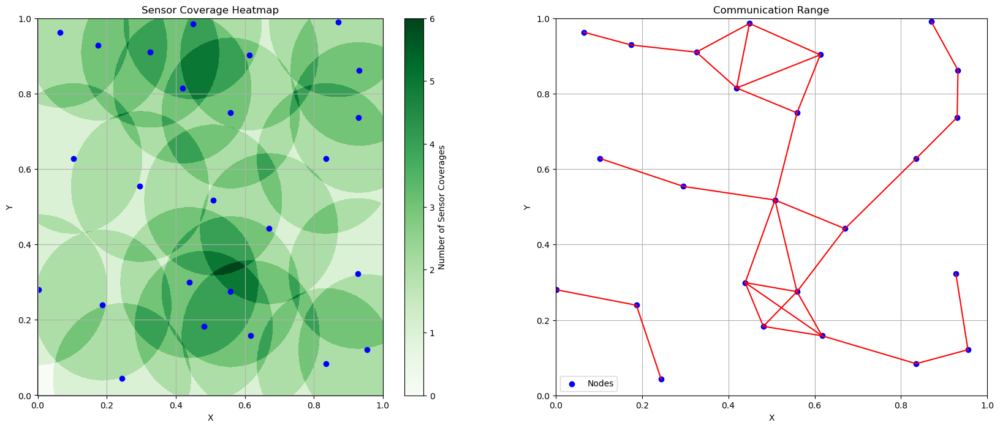
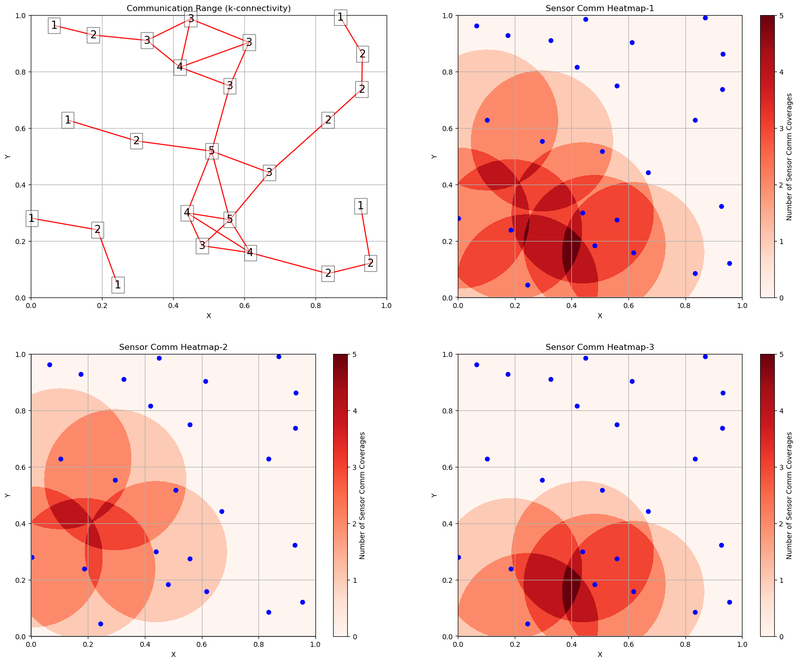
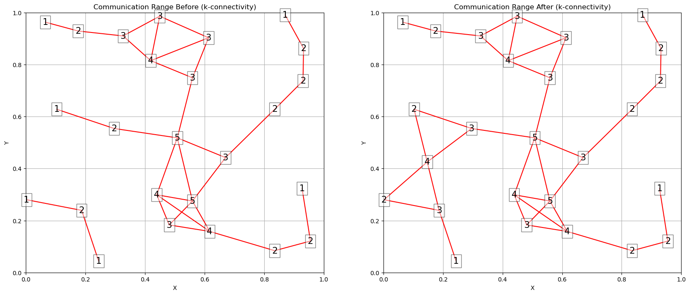

# Analysis of Random Geometric Graphs

Name: Da Cheng
Email: dcheng69@uwo.ca
ID: 251350918

## Objectives

Evaluating the Performance of a pseudo-randomly generated graph，as an abstraction of a wireless sensor network. The nodes information are listed in the `nodes.txt` file. The Sensor Coverage and Communication Range plots are described below:

One thing to notice, the 25 nodes given are not fully connected!

```bash
# nodes
0.439, 0.299
0.187, 0.239
# Communication Range
√((0.299−0.239)^2 + (0.439−0.187)^2) = 0.259L
```

So in order to make the graph fully connected, one node need to added to connect two sub-nets.



## Connectivity of the Network

As mentioned above, the connective of the original network is not **fully-connected**!. The `k-connectivity` of the original network is `1` which is shown in the **Communication Range** subplot, according to the **Sensor Comm Heatmap-1**, there are a few possible locations to put the points, which are coloured in dark red. Further more, **Sensor Comm Heatmap-2** and **Sensor Comm Heatmap-3** shows two direction of putting the extra point.



Combined with the **Sensor Coverage Hetmap**  above, I decide to add one point that has the equal distance to the following four points:

```bash
# put one point that has equal distances to the following four points
(0.187, 0.239), (0.002, 0.28), (0.103, 0.628), (0.296, 0.554)

#For the x-coordinate:
(0.187 + 0.002 + 0.103 + 0.296) / 4 = 0.147

#For the y-coordinate:
(0.239 + 0.28 + 0.628 + 0.554) / 4 = 0.42525

#So, the centroid is approximately
(0.147, 0.42525)
```

 After Adding this point, the `k-connectivity` is still `1`, but the whole network becomes **fully-connected**!
