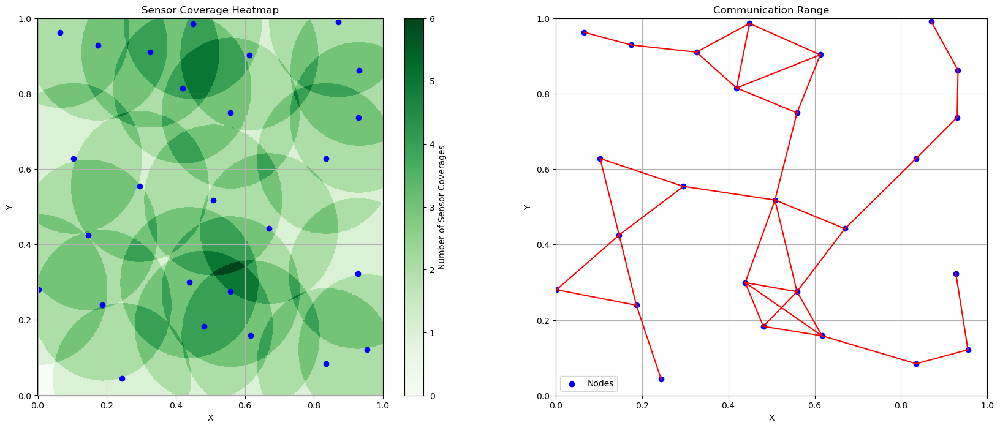
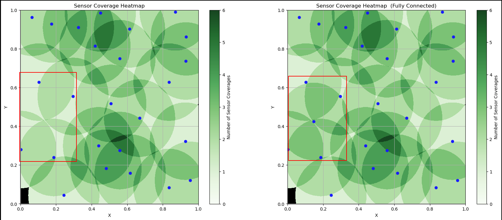
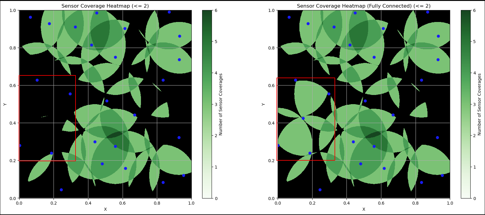
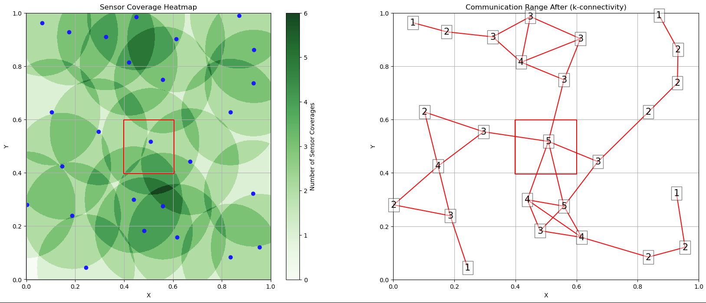

# Analysis of Random Geometric Graphs

Name: Da Cheng
Email: dcheng69@uwo.ca
ID: 251350918

## Objectives

Evaluating the Performance of a pseudo-randomly generated graph，as an abstraction of a wireless sensor network. The nodes information are listed in the `nodes.txt` file. The Sensor Coverage and Communication Range plots are described below:

One thing to notice, the 25 nodes given are not fully connected!

```bash
# nodes
0.439, 0.299
0.187, 0.239
# Communication Range
√((0.299−0.239)^2 + (0.439−0.187)^2) = 0.259L
```

So in order to make the graph fully connected, one node need to added to connect two sub-nets.


## Connectivity of the Network

As mentioned above, the connective of the original network is not **fully-connected**!. The `k-connectivity` of the original network is `1` which is shown in the **Communication Range** subplot, according to the **Sensor Comm Heatmap-1**, there are a few possible locations to put the points, which are coloured in dark red. Further more, **Sensor Comm Heatmap-2** and **Sensor Comm Heatmap-3** shows two direction of putting the extra point.


Combined with the **Sensor Coverage Hetmap**  above, I decide to add one point that has the equal distance to the following four points:

```bash
# put one point that has equal distances to the following four points
(0.187, 0.239), (0.002, 0.28), (0.103, 0.628), (0.296, 0.554)

#For the x-coordinate:
(0.187 + 0.002 + 0.103 + 0.296) / 4 = 0.147

#For the y-coordinate:
(0.239 + 0.28 + 0.628 + 0.554) / 4 = 0.42525

#So, the centroid is approximately
(0.147, 0.42525)
```

 After Adding this point, the `k-connectivity` is still `1`, but the whole network becomes **fully-connected**!

## Accurate Diagram of the Network

After Adding one node to the `nodes.list` now let's take a look at the communication and the sensor coverage diagram, on the left hand side is the `sensor coverage heatmap`, the darker the higher coverage rate, on the right hand side is the `communicate range diagram`, shows a fully connected diagram.



## Coverage of the Network

We have already demonstrate in the `Connectivity of the Network` that how we add one node `(0.147, 0.42525)` to make the network fully connected, and the reason of adding this node is that this node will largely enhance the coverage of this area, details can be shown in below diagram, the area with `0-coverage` is depicted with black colour! 



From above diagram we can tell that adding this node will not affect the area with `0` coverage, but will enhance the coverage of the areas depicted using red square. Further more, we can show the enhancement by adding below two diagrams, as we can see when make the area with the sensor coverage `<=2` coloured in black, we can see that by adding the extra one point we have successfully increased the robustness of the area designated by red squares.



However, if we take a look at the overall coverage diagram, we can see that after adding one extra node, the `k-coverage` of the network is still `0`, and when we blank more and more area by increasing the thresh-hold value of blacking, we can see that the coverage of this network has been located to specific areas that have higher density of sensor deployments. and we should notice that the connection part of the upper and lower part of the diagram will be separated once we lose this point from the network.


