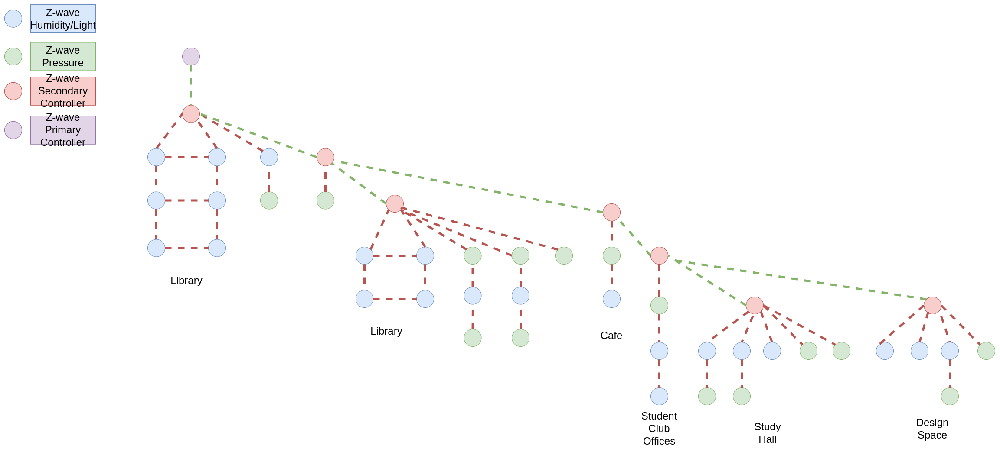
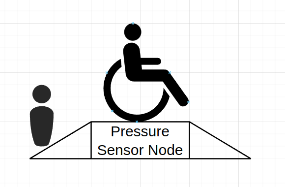
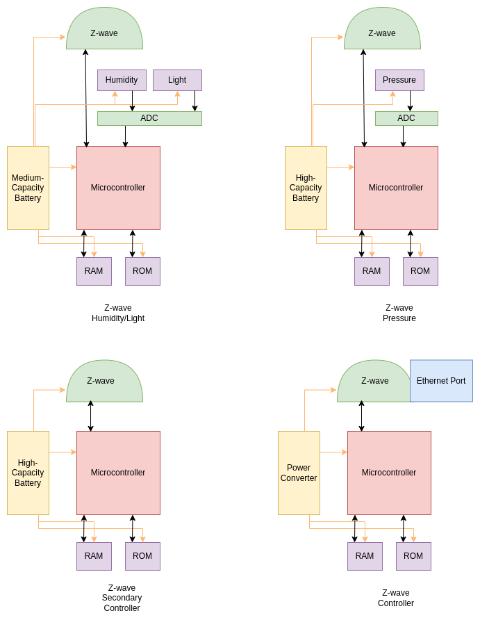

# Design a WSN

Name: Da Cheng
Email: dcheng69@uwo.ca
ID: 251350918

## Objectives

This lab is about designing a wireless sensor network to perform a specific task within certain design constraints. Most of this lab is making design decisions, so there a lot of detailed quantitative analysis is not necessary.

### Goal

Design a wireless sensor network to track an animal population and monitor environmental conditions in a given habitat.

The sociology and biology departments of the Brantford University of Teaching & Technology (BUTT) would like to study the distribution and behaviour of a particularly strange breed of animal: undergraduate engineering students. They have noticed that these students tend to cluster in the gloomy basements of the Engineering building. 

### Requirements

The sociology and biology departments have commissioned you to design a WSN to monitor the area to help
collect the following data:

* Your WSN should provide humidity sensors over the region. (Undergraduate engineering students have notoriously poor personal hygiene. Is this because they are sensitive to moisture?)
* Your WSN should provide light sensors over the region. (Undergraduate engineering students are often nocturnal. Is this because they are sensitive to light?)
* Your WSN will attempt to roughly track population migration by having pressure sensors on the floor that are triggered when someone steps on them. (Where do the undergraduate engineering students congregate? Are they social or antisocial within their own habitat?)
* Your WSN needs to provide its own wireless communication. It cannot use BUTT’s campus WiFi network.
* Your WSN nodes can only use external power if that node is at an existing power outlet. You can’t run an
  extension cord or rewire the power grid.
* Only one of the WSN nodes can connect to wired ethernet 
* Only a node that is located at an existing Ethernet outlet can use the Ethernet. You can’t run an ethernet cable across the floor. One node must be connected this way in order to transmit the WSN data to the relevant researchers.
* The sociology/biology researchers have little to no funding. Your WSN design has a budget of **$3000** for hardware (deployment cost is free)
* Your network must be fully connected.
* Your network should provide as much coverage as possible, within the cost constraints.
* Your network should have as long an operating lifespan as possible, within the cost constraints.

## Design Philosophy of the WSN

1. The WSN employs a heterogeneous strategy to maximum the cost efficiency.  

2. The WSN will be deployed with  a grid structure as shown in the following graph. the Z-wave Humidify/Light nodes are mounted on the ceiling, therefore a grid structure would provide a better results without collecting too much data from a single area.

3. The WSN has a 1-connectivity, red points in the graph are secondary controllers, they are particularly sensitive to device failure in terms of connectivity. The following graph shows how these nodes are connected with each other using secondary controllers as relays.

4. According to the course material 《Lesson_10_WSN_standards.pdf》page 10, Figure 4, the communication beound 4 hops can be achieved by utilising the secondary controller nodes by programming it differently. To help to address the connectivity problem, I draw the following abstract version of WSN node in terms of connectivity. Thanks to Z-wave's relatively large communication range (30m), most of the node have more than one connected nodes, but connecting all the nodes will make the graph complicated to read, therefore I simplified it to examine the full connectivity!

   To understand the connectivity, just count the hops from the sensor nodes to the secondary controllers, it does not exceeds the limits of 4-hops, and secondary controllers has been specially programmed to reply the data and instruction to up layer secondary controllers until the message hit the primary controller.

5. The expected lifespan of the network is 1 year. The primary controller is connected to the power grid, therefore can run as long as it can be, so the bottle neck is the durance of the sensor nodes as well as the secondary controllers, because they run on batteries. After calculation, the WSN should hold slightly longer than 1 year.

6. From the above graph we can observe that the secondary controllers control the transmission of data, therefore anyone of them broken will cause part of the WSN not reachable! 
7. Because the secondary controller nodes are sensitive to device failure, regular check and replace are needed on a monthly basis. Therefore I will add extra budgets to replace the broken nodes and keep the WSN running.

## Design Philosophy of Sensor Coverage

### Humidify/Light Sensors

From the above graph, we can observe that blue nodes are the Humidify/Light sensors, they are equally distributed across the building, providing coverage to most of the areas. Because the Humidify and Light sensor only provide information for a small distance from the sensor itself, so I choose to scatter them with a distance between 7.5m to 10m, therefore preventing the data collected by the sensors lack representation of the whole area.

### Pressure Sensors

The pressure sensors are green nodes, and they are mounted on the floor. It will be installed under a ramp and placing on every exits. Placing the pressure under a ramp not only helps to protect the sensors as well as provides convenience for students with disability. And because we placed pressure sensors at every exits of the building, and we will collect data whenever the pressure surpassed its defined threshold values, along with a time stamp. When we collecting the data from the pressure sensors, it will give us a time based statics of every room in this building. This will help us to understand how the students migrate at different time among the day.

## Construction of the Nodes in WSN

There are four different types of nodes, all listed in the following graph. From the graph we can see that:

* I installed humidify and light sensor on a single node with medium capacity battery, because it will be mounted on the ceiling, and scheduled to collect data periodically.
* The Pressure sensor installed on a single node and installed on the floor, placed under a ramp on every exits of every room, unlike the humidify/light sensor nodes, the pressure nodes will be collect data whenever the pressure surpassed the threshold value with a timestamp. Because it will collect more data therefore high capacity battery is chosen to achieve a balanced lifespan when compared with humidify/light sensor nodes.
* The Z-wave secondary controller nodes are mounted on the ceiling, programmed to relay information it get to next secondary nodes until it get to the primary controller node, therefore no sensor mounted, equipped with high capacity battery to handle network transmissions.
* The Z-wave primary controller node is mounted on the wall with no sensors, uses power converter to provide power supply, and Ethernet port to give transfer the data to the host machine for analysis.

## Deployment of the Network

The deployment of the network is shown in the following graph. 

* The blue nodes are the Humidify/Light sensor nodes, they are mounted on the **ceiling** to prevent abnormal data, for example when mounted on the wall the shadow created by student passing by can influence the reading of the light sensor, and when student accidentally sprayed water on it it will also giving abnormal data.
* The green nodes are the Pressure sensor nodes, because they will measure the pressure data so they have to be placed on the ground. Just like we mentioned in the previous section, we plan to place the sensor under a ramp, which will not only provide convince for the students with disability, but also prevent student destroy or play with the sensor on purpose or accidentally.
* The Secondary Controller are mounted on the ceiling which can prevent the student destroy it, but it will surely bring inconvenience for the maintenance of the network.
* There is only one Primary Controller node in the network, which are mounted on the wall, close to the power outlet and Ethernet port to be able to handle the data transmission  and providing unlimited power for the control purpose of the network.

## Operating Procedure of the WSN

### Data Collection

1. The Humidity/Light sensors are installed on the same node but they can acquire data at the same time without interfering each other. The data collection of Humidify/Light sensors will happen at regular intervals-every 30 minutes. The operating time will only cover 8am to 23:55 pm, because obviously there are not enough study objects (students!) in the building during the midnight! The data collected contains humidify/light value as well as time stamp.
2. The pressure sensors will employ the trigger mode, whenever the its surpassing the threshold value, the pressure value as well as the time stamp will be collected.
3. Both sensors will record quantitative measurements as well as time stamp of the data being collected.

### Evaluation of the Data Acquired

The humidify and light data are collected every half a hour, so they will give us a condition of each room including the aisles. The pressure data is collected at every exits of the each room, therefore checking the pressure value as well as the trigger times displayed on the time span will help us understand the distribution of students in every room at anytime of the day.

And finally when we combine these two data together, we will able to get the relationship between the humidify and light condition and the student population. 

## Strengths/Weaknesses of the WSN

Because we placed pressure at every exits, so target will be recorded by the sensor unless it find a way to bypass the sensor, for example, jump through the ramp.

**Strengths:**

* Humidify/Light sensors share the same micro-controller, maximum the cost efficiency, reduce the deployment difficulty.
* Because this WSN employed a gird structure, therefore provide reliable data of the building, also the pressure sensor are mounted on the floor under a ramp which is friendly to people with disability.

**Weaknesses:** 

* The secondary controller are sensitive to device failure, anyone of the secondary controller failure will cause part of the network unreachable, therefore timely maintenance is needed every month, this adds to the budget of the running of the WSN.
* The Secondary Controllers and the Humidify/Light sensor nodes are mounted on the ceiling, increase the maintenance difficulty.

## Budget of the WSN

| Item                              | Cost | Number | Total |
| :-------------------------------- | :--: | :----: | ----: |
| Z-wave Humidity/Light Sensor Node | $49  |   22   | $1078 |
| Z-wave Pressure Sensor Node       | $57  |   15   |  $855 |
| Z-wave Secondary Controller Node  | $55  |   7    |  $385 |
| Z-wave Primary Controller Node    | $40  |   1    |   $40 |
| Maintenance (Monthly Basis)       | $500 |   1    |  $500 |
|                                   |      |        | $2858 |

# Summary

In this project I applied what I learned in this class into a real world scenario, I know how to analyse a WSN as well as implementing one on my own. I know this solution for WSN is not perfect, but that's the best I can give for now! Thanks for the content I learned in this course. I believe I will benefit from it for the rest of my life. 
